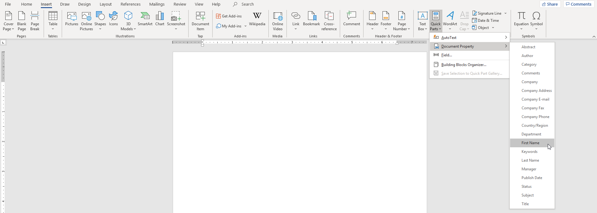

# Generating user-friendly PDFs from SharePoint list items in Azure Logic Apps and Power Automate

Using standard connectors, both Azure Logic Apps and Power Automate can re-create "print to PDF" functionality previously available in older SharePoint applications. The most preferable approach is the one where business users can easily maintain a template for the PDF file and a no-code approach can be used. This pattern will demonstrate how a Microsoft Word document can serve as the template for generating PDF files from SharePoint list items.

> Note: The account used for connections must be able to connect both to SharePoint and OneDrive for Business. OneDrive for Business actions are leveraged to convert the readied Word document to PDF and OneDrive for Business must serve as an intermediary to do this without the use of premium connectors as of March 2021.

The high-level approach uses an instant flow triggered on a SharePoint list item. The flow is implemented as follows and relies upon a pre-configured document library to house the Word documents used to generate the PDF files.

1. Get the SharePoint list item data as text, using the `FieldValuesAsText` REST endpoint.
2. Get the contents of the template Word document file.
3. Re-upload a copy of the template to the pre-configured document library with the desired file name.
4. Update the properties of the Word document file uploaded in Step 3 from the information gathered in Step 1.
5. Retrieve the contents of the Word document file, which now has all of the data in it. This document will serve as the basis for the PDF.
6. Delete the Word document file from SharePoint, as it is no longer needed since the contents of this file are stored within the flow now.
7. Upload the Word document file to OneDrive for Business.
8. Convert the Word document file to a PDF.
9. Delete the Word document file from OneDrive for Business, as it is no longer needed since the contents of the generated PDF file are stored within the flow now.
10. The contents of the generated PDF file are available to the remainder of the flow for use in whatever way is desired. Typical actions include uploading the PDF to a SharePoint library, attaching the PDF to a SharePoint list item, and/or emailing the PDF.

## Setup a pre-configured document library to match the list and house the template

To prepare for generating the PDF documents, one must first create a document library with similar columns as the source list. These columns do not have to match the source list exactly. In fact, it will make future maintenance of this solution easier if the document library's columns do not match the source list's columns. In the end, every column in the source list needs to be exposed to the destination Word document (and eventually PDF) as text. Therefore, when creating columns to mimic the source list, use either the Single Line of Text or Multiple Lines of Text field types. Be careful not to attempt to condense a Multiple Lines of Text field on the source list into a Single Line of Text field on the document library!

## Create the Word document template within the pre-configured document library

Navigate to the pre-configured document library. Create a new Word document with any given file name. A file name like **Template.docx** is suggested.

Put any content, formatting, images, etc. into the Word document that is desired to build the foundation for what will be used to generate the PDF file.

To put content from the list item into the Word document, use the Quick Parts feature to add Document Properties to the document. To access that feature, select the **Insert** ribbon. Under the **Text** group (towards the right of the ribbon), select the second button which is **Quick Parts**. In the resulting menu, hover over **Document Property**, then select the desired property to insert into the document. Each property can be used as many times as desired, including not being used at all in the document.

Note that as many template files can be created and used in the flow as are desired, if there is a requirement to have multiple templates available for the same list.

## Create the instant flow to generate the PDF

When creating the new flow, create an instant flow and use the **For a selected item** trigger in the **SharePoint** connector. Enter the **Site Address** and **List Name** for the source list.

### Get the SharePoint list item data as text

The first action under the trigger is the **Send an HTTP request to SharePoint** action in the **SharePoint** connector. This action will retrieve the list item's data.

Rename this action to **Get list item data as text**. This name will be used in later expressions, so rename it before proceeding so other expressions do not need to be adjusted later.

Populate the following properties:

Property | Value
--- | ---
Site Address | *Use the same site address as the trigger.*
Method | `GET`
Uri | `_api/Lists/GetByTitle('LIST TITLE')/Items(@{triggerBody()?['entity']?['ID']})/FieldValuesAsText`  *Replace LIST TITLE with the title of the list from the trigger.*
Headers | `Accept: application/json;odata=nometadata`
Body | *Leave the body empty. There is no body that should be sent since this is a GET request.*

### Get the Word document template content

The next action is the **Get file content** action in the **SharePoint** connector. This action will download a copy of the template.

Rename this action to **Get Word document template content**. This name will be used in later expressions, so rename it before proceeding so other expressions do not need to be adjusted later.

Populate the following properties:

Property | Value
--- | ---
Site Address | *Use the same site address as the trigger.*
File Identifier | *Use the folder icon to the right side of the property field to open a file selector and select the desired Word document template file. This should be a DOCX file, not a DOTX file. This property will contain the site-relative URL to the Word document template file starting with a forward slash.*

### Create the Word document

The next action is the **Create file** action in the **SharePoint** connector. This action will upload a copy of the template to serve as the foundation of the document that will eventually be converted to a PDF.

Rename this action to **Create Word document**. This name will be used in later expressions, so rename it before proceeding so other expressions do not need to be adjusted later.

Populate the following properties:

Property | Value
--- | ---
Site Address | *Use the same site address as the trigger.*
Folder Path | *Use the folder icon to the right side of the property field to open a folder selector and select the desired PDF document library that was created for this flow. This property will contain the site-relative URL to the root folder of this document library starting with a forward slash.*
File Name | *Construct any file name desired using an expression. Ensure it includes `.docx` at the end of the file name. The file name might include the item's ID and a timestamp. Including a timestamp is recommended so that multiple runs of this flow to do not interfere with one another as users may trigger the flow multiple times on a single list item. The following formula can be used as a timestamp: `@{formatDateTime(utcNow(), 'yyyyMMdd-HHmmss')}`*
File Content | *Use the `File Content` parameter from the previous Get Word document template content action.* `@{outputs('Get_Word_document_template_content')?['body']}`

### Write list item data into the Word document

The next action is the **Update file properties** action in the **SharePoint** connector. This action will update the properties of the Word document, which ultimately causes the list item data to be written into the Word document.

Rename this action to **Write list item data to Word document**. This name will be used in later expressions, so rename it before proceeding so other expressions do not need to be adjusted later.

Populate the following properties:

Property | Value
--- | ---
Site Address | *Use the same site address as the trigger.*
Library Name | *Select the PDF document library that was created for this flow.*
Id | *Use the `ItemId` parameter from the previous Create the Word document action.* `@{outputs('Create_Word_document')?['body']?['ItemId']}`*

After the Site Address and Library Name properties are populated, the fields in that library will appear underneath the Id property. Using the data from the **Get list item data as text** action, populate the properties. One can perform text manipulation as desired to put whatever data is necessary into the Word document. In the most common use case, property values will just be copied from the **Get list item data as text** action into this action. For example, the formula to bring in the Title property would be `@{outputs('Get_list_item_data_as_text')?['body']?['Title']}`

Note that the properties will not be listed by Power Automate in the **Get list item data as text** action. Only a **body** property will be listed. One is required to manually enter the formula using the internal name of the desired property. For example, `@{outputs('Get_list_item_data_as_text')?['body']?['INTERNAL NAME']}` where INTERNAL NAME is replaced with the internal name of the desired property.

### Get the completed Word document

The next action is the **Get file content** action in the **SharePoint** connector. This action will get the completed Word document file from SharePoint now that the data has been populated into the document.

Rename this action to **Get completed Word document**. This name will be used in later expressions, so rename it before proceeding so other expressions do not need to be adjusted later.

Populate the following properties:

Property | Value
--- | ---
Site Address | *Use the same site address as the trigger.*
File Identifier | *Use the Identifier property from the previous Write list item data to Word document action.* `@outputs('Write_list_item_data_to_Word_document')?['body']?['{Identifier}']`

### Delete the completed Word document

The next action is the **Delete file** action in the **SharePoint** connector. This action will delete the completed Word document file from SharePoint now that the data has been retrieved into the flow and the file is no longer needed.

Rename this action to **Delete completed Word document**. This name will be used in later expressions, so rename it before proceeding so other expressions do not need to be adjusted later.

Populate the following properties:

Property | Value
--- | ---
Site Address | *Use the same site address as the trigger.*
File Identifier | *Use the Identifier property from the Write list item data to Word document action.* `@outputs('Write_list_item_data_to_Word_document')?['body']?['{Identifier}']`

### Upload the completed Word document to OneDrive

The next action is the **Create file** action in the **OneDrive for Business** connector. This action will take the completed Word document and upload it to OneDrive so that the flow can convert the document to a PDF using the standard OneDrive for Business connector. Do not forget to use the OneDrive for Business connector instead of the SharePoint connector for this action and the next action. Also, be sure to use the OneDrive for Business connector and not the OneDrive connector. The latter connector is for personal (non-work) Microsoft accounts only.

Rename this action to **Upload completed Word document to OneDrive**. This name will be used in later expressions, so rename it before proceeding so other expressions do not need to be adjusted later.

Populate the following properties:

Property | Value
--- | ---
Folder Path | `/`
File Name | *Any unique file name can be used for this property. It is suggested that the same file name be copied from the Create Word document action. It is also very important to ensure a timestamp is included in this file name to reduce the chance of naming conflicts.*
File Content | *Use the File Content property from the previous Get completed Word document action.* `@{outputs('Get_completed_Word_document')?['body']}`

### Convert the completed Word document to a PDF

The next action is the **Convert file** action in the **OneDrive for Business** connector. This action will take the uploaded completed Word document and convert it to a PDF. Remember to use the OneDrive for Business connector and not the OneDrive connector. The latter connector is for personal (non-work) Microsoft accounts only.

Rename this action to **Convert Word document to PDF**. This name will be used in later expressions, so rename it before proceeding so other expressions do not need to be adjusted later.

Populate the following properties:

Property | Value
--- | ---
File | *Use the Id property from the previous Upload completed Word document to OneDrive action.* `@outputs('Upload_completed_Word_document_to_OneDrive')?['body']?['Id']`
Target type | PDF

### Delete the uploaded Word document in OneDrive

The next action is the **Delete file** action in the **OneDrive for Business** connector. This action will remove the uploaded completed Word document from OneDrive since it is no longer needed after the conversion has taken place. Remember to use the OneDrive for Business connector and not the OneDrive connector. The latter connector is for personal (non-work) Microsoft accounts only.

Rename this action to **Delete uploaded Word document from OneDrive**. This name will be used in later expressions, so rename it before proceeding so other expressions do not need to be adjusted later.

Populate the following properties:

Property | Value
--- | ---
File | *Use the Id property from the previous Upload completed Word document to OneDrive action.* `@outputs('Upload_completed_Word_document_to_OneDrive')?['body']?['Id']`

### Use the generated PDF

At this point in the flow, the contents of the generated PDF is available via the following formula: `@{outputs('Convert_Word_document_to_PDF')?['body']}`

Typical actions that can be taken at this point include:
- Uploading the PDF to a SharePoint document library
- Attaching the PDF to a SharePoint list item
- Emailing the PDF

Complete the remainder of the flow as appropriate for the actions required for the PDF. Remember when naming the PDF file, it is recommended to use a pattern including a timestamp (for example, `@{formatDateTime(utcNow(), 'yyyyMMdd-HHmmss')}`) and remember to end the file name with a `.pdf` extension.

## Enable the user to generate the PDF

If using an instant flow in Power Automate, the users can generate the PDF by starting the new instant flow within any of the source list's views. For more information on how to enable this, see [Starting Power Automate Instant Flows from SharePoint List Views](../starting-instant-flows/README.md).

If using an Azure Logic App, there are other available methods to start the Logic App.
