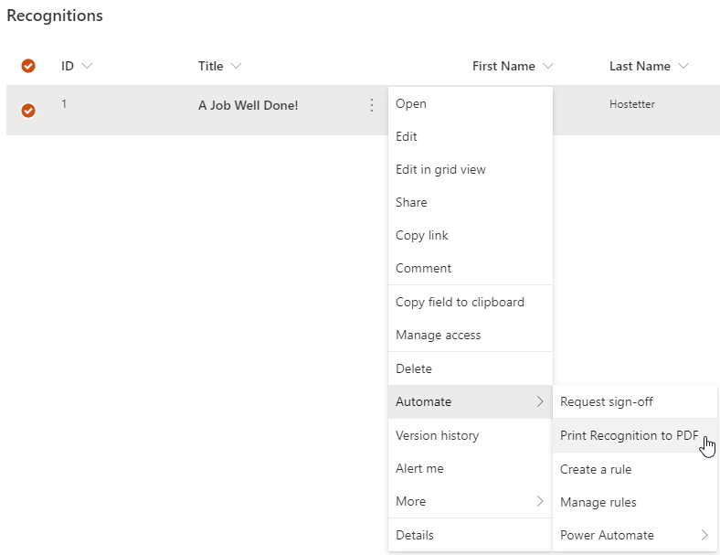
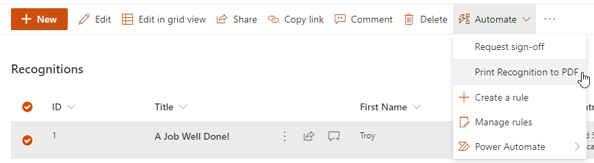

# Starting Power Automate Instant Flows from SharePoint List Views

> Note: This only applies to Power Automate. Logic Apps cannot be started using this method.

Power Automate instant flows can be started at will from SharePoint list items. There are multiple ways to do start these type of flows. SharePoint provides an out-of-the-box menu to start these types of flows. Or, a custom button, icon, and/or link can be configured to start these types of flows from list views.

## Out of the box menu

SharePoint provides a method to start any instant flow associated with a list via the toolbar and via the context menu for the list item in a view. There are multiple benefits for leveraging this option. SharePoint will update the list of instant flows to match whatever is available. Also, there is no setup, configuration, or customization required to use this feature as it is built into the platform. However, it does require a few extra clicks for the end user and potentially additional training to show the user how to get to that functionality.

The instant flows available with a SharePoint list item can be started from either the list item's context menu or from the list view's toolbar.

Content menu | Toolbar
---|---
 | 

## Configured button on the list view

SharePoint provides a method to configure how a list column is displayed in a list view. A button can be created to show in any given column that will start an instant flow.

To start with this configuration, choose one of the following:

- Pick an existing column that should be leveraged to show the button. Typically, this option is used with scenarios such as approval status columns. One might want to show an "Send for approval" button instead of a "Not started" status text as this is more contextually appropriate and guides users intuitively towards starting an approval when ready to do so. Once the approval status contains different text (presumably after the approval instant flow was started), the column could be configure to show the status text itself instead of the button.

- Create a new column that will only be leveraged to show the button. Typically, this option is used with scenarios involving actions that could always be taken, such as generating a PDF document from a list item, where the button should always be visible and isn't necessarily tied to any existing column.

If creating a new column on the list to be configured with the button, consider using a Yes / No field type, as that uses the [least amount of space](https://docs.microsoft.com/en-us/sharepoint/install/software-boundaries-and-limits-0#column-limits). Once the new column is created, [hide the new column from the list form](https://docs.microsoft.com/en-us/sharepoint/dev/declarative-customization/list-form-conditional-show-hide) so that it does not mistakenly appear as part of the list forms.

After determining the column to use with the button, follow the steps provided in the article [Use column formatting to customize SharePoint under the Create a button to launch a Flow heading](https://docs.microsoft.com/en-us/sharepoint/dev/declarative-customization/column-formatting#create-a-button-to-launch-a-flow).

Note that the button does not require any text or the use of an icon. Both are provided in the example code from Microsoft but one or the other may be omitted for a smaller button if desired. Additionally, one can find a full searchable listing of all available Fluent UI icons here: [Fluent UI Icons](https://developer.microsoft.com/en-us/fluentui#/styles/web/icons#available-icons). Any desired icon name can be used in the JSON configuration for the `iconName` attribute. Also, do not forget to consider using custom `headerText` and `runFlowButtonText` options per the Microsoft article referenced above to configure the Flow panel that starts the instant flow.

Do not use the default formatting of a button. It does not provide a user experience that matches the rest of SharePoint's modern list view experience and could confuse users. Please ensure, as shown in the Microsoft article referenced above, that at a minimum, the following styles are applied.

```json
"style": {
  "border": "none",
  "background-color": "transparent",
  "cursor": "pointer"
}
```

# References

- [Microsoft Docs: Use column formatting to customize SharePoint > Create a button to launch a Flow](https://docs.microsoft.com/en-us/sharepoint/dev/declarative-customization/column-formatting#create-a-button-to-launch-a-flow)
- [Button in SharePoint List to Trigger Power Automate by Laura Rogers, a highly regarded Microsoft MVP with many years of experience with Microsoft 365, including SharePoint and the Power Platform](https://wonderlaura.com/2018/07/18/button-in-sharepoint-list-to-trigger-microsoft-flow/)
