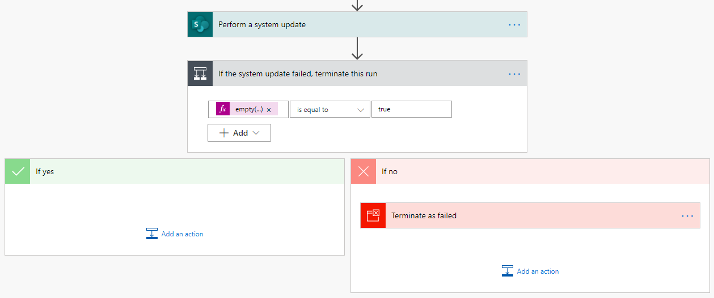
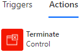

# Performing a SharePoint SystemUpdate call in Azure Logic Apps and Power Automate

In SharePoint 2010 workflows, an action was available to update the list item that triggered the workflow without causing the workflow to trigger again. Unfortunately, as of September 2020, this is not the case using the out-of-the-box actions from the SharePoint connector in Azure Logic Apps or Power Automate. Using the out-of-the-box **Update item** action in the SharePoint connector causes the update event to fire and the Logic App or Flow to trigger once more if it is set to trigger on list item updates.

A solution is required that is generic, does not require changes to the underlying list, and will avoid infinite loops. Using the SharePoint `SystemUpdate()` method is one way to avoid firing an update event which will avoid re-triggering logic apps and flows. However, there exists no action in the SharePoint connector to achieve this nor REST API that can be called. The CSOM API now supports this method. This repository will review how to make a call directly into the CSOM API from a logic app or flow to utilize the `SystemUpdate()` method.

Note that the `SystemUpdate()` method is used to update field values without triggering an updated Modified By user, an updated Modified time stamp, and an update event.

To build this call and properly handle errors, three actions will need to be created.



## 1) Perform a system update

This utilizes the **Send an HTTP request to SharePoint** action in the **SharePoint** connector. Start by selecting that action.


Rename this action to **Perform a system update** or some other memorable name. This name will be used in later expressions, so give it a name before proceeding so other expressions do not need to be adjusted later.

Populate the following properties:

| Property | Value |
| --- | --- |
| Site Address | *Use the same site as the trigger* |
| Method | `POST` |
| Uri | `_vti_bin/client.svc/ProcessQuery` |
| Headers | `Accept */*` |
| | `Content-Type text/xml;charset="UTF-8"` |

The `_vti_bin/client.svc/ProcessQuery` endpoint is a WCF (Windows Communication Foundation) Service that is called when the CSOM API calls the `ClientContext.ExecuteQuery()` method for those familiar with the CSOM API. The body of the request is constructed in two sections: `ObjectPaths` and `Actions`. In the `ObjectPaths` section, property and method references are used to build up which object(s) can be referenced in the `Actions` section. In the `Actions` section, methods can be called against any of the objects from the `ObjectPaths` section. For the purposes of using the `SystemUpdate()` method, the final call for each list item being operated against is a call to the `SystemUpdate()` method.

Multiple list items can be updated in a single request. Any arbitrary CSOM code can be put together into a single request. This document will cover the common use case of making updates to the single list item that triggered the logic app or flow. For more details and explanation about how the XML is built and examples of how to update multiple list items in a single request, see [SharePoint Client Query Request XML](sharepoint-client-query-request-xml.md).

To construct the body of the request for the single list item that triggered the logic app or flow, start with the XML below. This XML can be pasted directly into the action.

```xml
<Request xmlns="http://schemas.microsoft.com/sharepoint/clientquery/2009" SchemaVersion="15.0.0.0"
         LibraryVersion="16.0.0.0" ApplicationName="<!--APPLICATION_NAME-->">
    <Actions>
        <!--METHODS-->
    </Actions>
    <ObjectPaths>
        <StaticProperty Id="0" TypeId="{3747adcd-a3c3-41b9-bfab-4a64dd2f1e0a}" Name="Current" />
        <Property Id="1" ParentId="0" Name="Web" />
        <Method Id="2" ParentId="1" Name="GetListItem">
            <Parameters>
                <Parameter Type="String"><!--SERVER_RELATIVE_WEB_URL-->/@{triggerBody()?['{FullPath}']}</Parameter>
            </Parameters>
        </Method>
    </ObjectPaths>
</Request>
```

For the three comments above, replace those comments with content relative to the updates to be made.

For `<!--APPLICATION_NAME-->`, replace it with either `Logic Apps` or `Power Automate` depending on the current platform being used. This is ultimately an arbitrary name but the SharePoint CSOM API requires it be populated with a value.

For `<!--SERVER_RELATIVE_WEB_URL-->`, replace it with the server-relative URL of the trigger's site. For example, if the trigger is set to use the site address `https://contoso.sharepoint.com/sites/ModernTeam`, then the server-relative URL is `/sites/ModernTeam`

For `<!--METHODS-->`, create a section of XML for each field value that needs to be updated. These sections represent setting each field value and can be repeated as many times as necessary; once for each field value that needs to be updated. Lastly, there will be one final section that will represent the call to the `SystemUpdate()` method.

For each field value that needs to be updated, use the following XML.

```xml
<Method Name="SetFieldValue" Id="<!--METHOD_ID-->" ObjectPathId="2">
    <Parameters>
        <Parameter Type="String"><![CDATA[<!--FIELD_INTERNAL_NAME-->]]></Parameter>
        <!--FIELD_VALUE_PARAMTER-->
    </Parameters>
</Method>
```

For `<!--METHOD_ID-->`, start with the number `3` and increment this value for each field. For example, if updating the values for three fields, the first field would use the number `3`, the second field would use `4`, and the third field would use `5`.

For `<!--FIELD_INTERNAL_NAME-->`, enter the exact internal name of the field that will be updated. Leave the `CDATA` start and end tags to ensure special characters are appropriately handled.

For `<!--FIELD_VALUE_PARAMETER-->`, see the [`SetFieldValue` field value parameter](setfieldvalue-field-value-parameter.md) article for details on the XML to use based on the field's type in SharePoint.

Putting together a full example of the `<!--METHODS-->` section, consider updating a `Status` field to `In Progress` and a `Completed` field to `No`. The XML would be built as follows.

```xml
<Method Name="SetFieldValue" Id="3" ObjectPathId="2">
    <Parameters>
        <Parameter Type="String"><![CDATA[Status]]></Parameter>
        <Parameter Type="String"><![CDATA[In Progress]]></Parameter>
    </Parameters>
</Method>
<Method Name="SetFieldValue" Id="4" ObjectPathId="2">
    <Parameters>
        <Parameter Type="String"><![CDATA[Completed]]></Parameter>
        <Parameter Type="String"><![CDATA[No]]></Parameter>
    </Parameters>
</Method>
```

The final section of XML to add to the `<!--METHODS-->` section instructs the API to call the `SystemUpdate()` method. Use the following XML.

```xml
<Method Name="SystemUpdate" Id="<!--SYSTEM_UPDATE_METHOD_ID-->" ObjectPathId="2" />
```

For `<!--SYSTEM_UPDATE_METHOD_ID-->`, use the number following the last `<!--METHOD_ID-->` number used above it. In the example above, if `4` was the last `<!--METHOD_ID-->` number used, then enter `5` for `<!--SYSTEM_UPDATE_METHOD_ID-->`.

Given the above examples, the full body for this request would be as follows.

```xml
<Request xmlns="http://schemas.microsoft.com/sharepoint/clientquery/2009" SchemaVersion="15.0.0.0"
         LibraryVersion="16.0.0.0" ApplicationName="Power Automate">
    <Actions>
        <Method Name="SetFieldValue" Id="3" ObjectPathId="2">
            <Parameters>
                <Parameter Type="String"><![CDATA[Status]]></Parameter>
                <Parameter Type="String"><![CDATA[In Progress]]></Parameter>
            </Parameters>
        </Method>
        <Method Name="SetFieldValue" Id="4" ObjectPathId="2">
            <Parameters>
                <Parameter Type="String"><![CDATA[Completed]]></Parameter>
                <Parameter Type="String"><![CDATA[No]]></Parameter>
            </Parameters>
        </Method>
        <Method Name="SystemUpdate" Id="5" ObjectPathId="2" />
    </Actions>
    <ObjectPaths>
        <StaticProperty Id="0" TypeId="{3747adcd-a3c3-41b9-bfab-4a64dd2f1e0a}" Name="Current" />
        <Property Id="1" ParentId="0" Name="Web" />
        <Method Id="2" ParentId="1" Name="GetListItem">
            <Parameters>
                <Parameter Type="String">/sites/ModernTeam/@{triggerBody()?['{FullPath}']}</Parameter>
            </Parameters>
        </Method>
    </ObjectPaths>
</Request>
```

## 2) If the system update failed, terminate this run
Unless there is an exceptional problem, the CSOM call will return an HTTP 200 response even if there is an error. If an error occurred, it would be in the body of the response. It is the flow author's responsibility to review the response from the previous call and terminate the flow with a failed status if an error occurred.

This action utilizes the **Condition** action in the **Control** connector. Start by selecting that action.


Rename this action to **If the system update failed, terminate this run** or some other memorable name.

Set the condition to the following:

```
empty(body('Perform_a_system_update')?[0]?['ErrorInfo'])
is equal to
true
```

*Note: Should the name of the first action been set to something other than **Perform a system update**, then be sure to update the first part of the condition. Note that any space in the name is replaced with an underscore in the expression.*

## 3) Terminate as failed
This action utilizes the **Terminate** action in the **Control** connector. Start by selecting that action within the **If no** side of the condition that was just created in the prior step.



Populate the following properties:

| Property | Value |
| --- | --- |
| Status | Failed |
| Code | `@{body('Perform_a_system_update')?[0]?['ErrorInfo']?['ErrorCode']}` |
| Message | `@{body('Perform_a_system_update')?[0]?['ErrorInfo']?['ErrorMessage']}`<br><br>`Error Type Name: @{body('Perform_a_system_update')?[0]?['ErrorInfo']?['ErrorTypeName']}`<br>`Trace Correlation ID: @{body('Perform_a_system_update')?[0]?['ErrorInfo']?['TraceCorrelationId']}` |

*Note: Should the name of the first action been set to something other than **Perform a system update**, then be sure to update the first part of the condition. Note that any space in the name is replaced with an underscore in the expression.*
