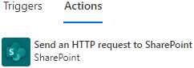
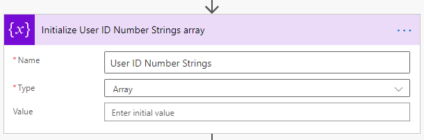
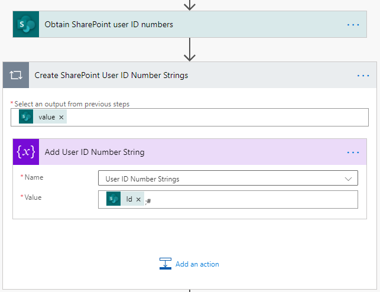
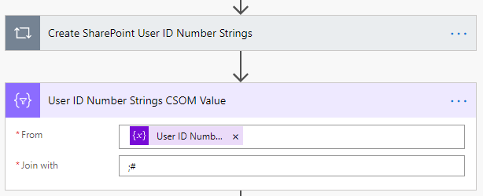

# How to obtain a SharePoint User ID number

To use the `SetFieldValue` method of the CSOM API with a person/group field, the user ID number must be obtained and used as the value. Unfortunately, this is not provided in the trigger of the Logic App or Flow. Only the following information is provided with person/group fields.

```json
{
    "ExampleUserField": {
        "@odata.type": "#Microsoft.Azure.Connectors.SharePoint.SPListExpandedUser",
        "Claims": "i:0#.f|membership|smayes@contoso.com",
        "DisplayName": "Steve Mayes",
        "Email": "smayes@contoso.com",
        "Picture": "https://contoso.sharepoint.com/sites/ModernTeam/_layouts/15/UserPhoto.aspx?Size=L&AccountName=smayes@contoso.com",
        "Department": null,
        "JobTitle": null
    }
}
```

# Obtaining a single user ID number

To obtain the SharePoint User ID number for a user, use the **Send an HTTP Request to SharePoint** action.



Rename this action to **Obtain the SharePoint user ID number** or some other memorable name. This name will be used in later expressions, so give it a name before proceeding so other expressions do not need to be adjusted later.

Use the `_api/Web/EnsureUser` endpoint. There are multiple ways to obtain the user ID number for a user, such as by querying the `_api/Web/SiteUsers` endpoint or querying the `User Information List`. However, leveraging `EnsureUser` adds the capability of providing an ID number to any valid user - even if that user hasn't been yet assigned an ID number on this particular site.

Populate the following properties:

| Property | Value |
| --- | --- |
| Site Address | *Use the same site as the trigger* |
| Method | `POST` |
| Uri | `_api/Web/EnsureUser?$Select=Id` |
| Headers | `Accept application/json;odata=nometadata` |
| | `Content-Type application/json` |

For the body of this request, use the claim value for the user. This value is guaranteed to be unique for each user and is required for the `EnsureUser` endpoint.

```json
{
    "logonName": "i:0#.f|membership|smayes@contoso.com"
}
```

To use a value from the trigger, use the following body which contains an expression. Within the expression, don't forget to use the internal name for the field.

```json
{
    "logonName": "@{triggerBody()?['ExampleUserField']?['Claims']}"
}
```

The action will provide the following output.

```json
{
    "Id": 42
}
```

To use this value in later actions, use the following expression.

```
body('Obtain_the_SharePoint_user_ID_number')?['Id']
```

# Obtaining multiple user ID numbers for users that already exist on the site

For users that absolutely are already part of the site (for example, when they are used on list items, they are part of the site), then other endpoints can be leveraged besides `EnsureUser` to get multiple user ID numbers in a single HTTP request.

To obtain SharePoint User ID numbers for multiple users, use the **Send an HTTP Request to SharePoint** action.


Rename this action to **Obtain SharePoint user ID numbers** or some other memorable name. This name will be used in later expressions, so give it a name before proceeding so other expressions do not need to be adjusted later.

Use the `_api/Web/SiteUsers` endpoint. The `User Information List` can also be queried directly but this endpoint is a shortcut to reach that list. Note again that any user obtained via this endpoint must already exist on the site to be found.

Populate the following properties:

| Property | Value |
| --- | --- |
| Site Address | *Use the same site as the trigger* |
| Method | `GET` |
| Uri | `_api/Web/SiteUsers?$Select=Id,LoginName&$Filter=FILTER-EXPRESSION` |
| Headers | `Accept application/json;odata=nometadata` |

For `FILTER-EXPRESSION` in the **Uri** property above, replace that with a filter for each user whose ID should be obtained. Build the following string/expression for each user.

```
LoginName eq '@{uriComponent(triggerBody()?['ExampleUserField1']?['Claims'])}'
```

The use of the `uriComponent` function is critical to the success of this filter. The claim value must be properly encoded to be safely passed as part of the **Uri**. If it is not, then the HTTP request will fail.

Once each user has the above string/expression built, concatenate them with `or` as follows.

```
LoginName eq '@{uriComponent(triggerBody()?['ExampleUserField1']?['Claims'])}' or LoginName eq '@{uriComponent(triggerBody()?['ExampleUserField2']?['Claims'])}' or LoginName eq '@{uriComponent(triggerBody()?['ExampleUserField3']?['Claims'])}'
```

Any number of users can be obtained using this method, up to the limit of the length of a valid URI. For practical purposes, it is unlikely to reach this limit with a normal amount of users to query.

Using the example above then, the full URI would be as follows.

```
_api/Web/SiteUsers?$Select=Id,LoginName&$Filter=LoginName eq '@{uriComponent(triggerBody()?['ExampleUserField1']?['Claims'])}' or LoginName eq '@{uriComponent(triggerBody()?['ExampleUserField2']?['Claims'])}' or LoginName eq '@{uriComponent(triggerBody()?['ExampleUserField3']?['Claims'])}'
```

Using some sample values instead of expressions, the full URI would be as follows.

```
_api/Web/SiteUsers?$Select=Id,LoginName&$Filter=LoginName eq 'i%3A0%23.f%7Cmembership%7Csmayes%40contoso.com' or LoginName eq 'i%3A0%23.f%7Cmembership%7Ctest1%40contoso.com' or LoginName eq 'i%3A0%23.f%7Cmembership%7Ctest2%40contoso.com'
```

The action will provide the following output.

```json
{
    "value": [
        {
            "Id": 42,
            "LoginName": "i:0#.f|membership|smayes@contoso.com"
        },
        {
            "Id": 50,
            "LoginName": "i:0#.f|membership|test1@contoso.com"
        },
        {
            "Id": 7,
            "LoginName": "i:0#.f|membership|test2@contoso.com"
        }
    ]
}
```

To use these user ID numbers in later actions, such as to create a value for the CSOM API such as `42;#;#50;#;#7;#` that could be passed as a value for a multi-valued user/group field, several actions and expressions will be required since the available functions are not able to parse arrays of objects easily.

1. Initialize an array variable named **User ID Number Strings**. Remember that all variables must be initialized immediately after the trigger prior to any other actions.



2. After the **Obtain SharePoint user ID numbers** action, create a new **Apply to each** action from the **Control** connector to iterate on the returned values and populate the **User ID Number Strings** array. Iterate on `body('Obtain_SharePoint_user_ID_numbers')?['value']`

3. Within the loop, add an **Append to array variable** action from the **Data Operation** connector to push each returned value into the **User ID Number Strings** array as it should be formatted for the CSOM API. Use the following value: `@{item()?['Id']};#`



4. After the **Create SharePoint User ID Number Strings** action, create a new **Join** action from the **Data Operation** connector to build the final string that can be used in the CSOM API. Select the values from the **User ID Number Strings** variable with the following expression: `@{variables('User ID Number Strings')}` Join them with the following string: `;#`



With the above actions in place, the following expression can be used in the CSOM API request.

```
body('User_ID_Number_Strings_CSOM_Value')
```
