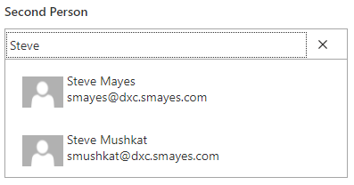
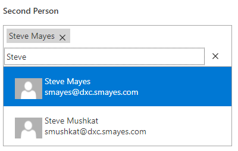
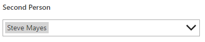

# People Picker Best Practices

Power Apps replicates the SharePoint people picker using a [combo box control](https://docs.microsoft.com/en-us/powerapps/maker/canvas-apps/controls/control-combo-box). When a canvas Power App generates a data card for a Person/Group field based on an existing SharePoint list, Power Apps will automatically generate the appropriate formulas within the combo box control so that users can be chosen per the SharePoint list column's configuration.

## Input Text Placeholder

For the `InputTextPlaceholder` property, use `"Enter a name or email address"` so that it matches SharePoint Online's out-of-the-box interface as of April 2021.

## Search Fields

By default, the field of the people data that Power Apps searches is the display name field. However, given that SharePoint searches both display names and email addresses, it is most prudent to include email addresses in the fields that Power Apps will search to show results to the user. It also matches the suggested input text placeholder above.

To update the field from the default, set the following value to the field's combo box's (`cmbPeoplePicker`) `SearchFields` property.

```
["DisplayName","Email"]
```

## Validation

### Quick Reference

1. Add the following formula to the app's form control's (`frmSharePoint`) `OnReset` property.

    ```
    Set ( gloFormSaveAttemptedByUser, false );
    ```

2. Add the following formula to the `SharePointIntegration` control's `OnSave` property.

    ```
    Set ( gloFormSaveAttemptedByUser, true );
    ```

3. Replace the formula for the field's error message control's (`lblPeoplePickerErrorMessage`) `Text` property with the following. The default value of the `Text` property is `Parent.Error`. If there is a different value in the property currently, ensure that the value is put into the formula below where `Parent.Error` is present.

    ```
    If (
        gloFormSaveAttemptedByUser And ( IsBlank ( cmbPeoplePicker.SelectedItems ) Or IsEmpty ( cmbPeoplePicker.SelectedItems ) ) And Not ( IsBlank ( cmbPeoplePicker.SearchText ) ),
        "Select a valid choice or delete the text above.",
        Parent.Error
    )
    ```

4. At the end of the `SharePointIntegration` control's `OnSave` property, add/replace the formula containing the `SubmitForm` formula with the following. The default value of the `OnSave` property is `SubmitForm ( frmSharePoint )`. If there is a different value **for the final formula of this property** currently, ensure that the value is put into the formula below where `SubmitForm ( frmSharePoint )` is present.
   
    ```
    If (
        IsBlank ( lblPeoplePickerErrorMessage.Text ),
        SubmitForm ( frmSharePoint ),
        false
    )
    ```

### Full Explanation

Power Apps' default configuration for people picker combo box controls ignores validating that users are properly selected. This leads to a sub-optimal user experience, where the user may believe they have picked a user when in fact they have not. The user would be better served by alerting them, when attempting to save the form, that there is a problem.

Start by reviewing how the combo box works. The `SearchText` - the text the user has typed in to find a particular value - typically starts out empty. When the user focuses on the control and types in a value, then the `SearchText` property is set to whatever the user types and the combo box filters the available values based on that `SearchText`.

- When nothing is selected,
  - When in focus, the Combo Box shows the `SearchText`.

    

  - When not in focus, the Combo Box also shows the `SearchText`. **_It is this behavior that could confuse users into thinking they have selected a valid value when they have not._** This is because there are no selected items at this point, but the control shows the `SearchText` which may trick the user into thinking a selection was made.

    

- When one or more items are selected,
  - When in focus, the Combo Box shows both the selected items then the `SearchText` beneath the selected items.
  
    

  - When not in focus, the Combo Box shows only the selected items. It does not show the `SearchText`.

    

Based on the scenarios above, it can be determined when the combo box has both nothing selected and non-blank `SearchText` using the formula below, assuming the name of the combo box control is `cmbPeoplePicker`.

```
(
    IsBlank ( cmbPeoplePicker.SelectedItems )
    Or
    IsEmpty ( cmbPeoplePicker.SelectedItems )
)
And
(
    Not
    (
        IsBlank ( cmbPeoplePicker.SearchText )
    )
)
```
*Additional whitespace added above is not required, but is used to make the formula easier to read.*

There is one final implementation detail to consider. The user should only be presented with an error message once they try to save the form. The app should not present the error message before the first save, because that may also confuse the user. Therefore, a variable must track when the first form save occurs. To do this, **add** the following formulas to the following action properties. Do not just replace these action properties' existing formulas if other logic exists in those properties; just prepend these formulas. Prepending the formula is especially important for the `SharePointIntegration.OnSave` property since it should be executed prior to the `SubmitForm` part of the formula.

```
frmSharePoint.OnReset (where frmSharePoint is the app's form control)
    Set ( gloFormSaveAttemptedByUser, false );

SharePointIntegration.OnSave
    Set ( gloFormSaveAttemptedByUser, true );
```

Next, set the field's error message's `Text` property with the following formula, replacing what is set by Power Apps. Note that if this `Text` property has already been customized, then put the current contents of the property into the formula below where it has `Parent.Error`.

```
lblPeoplePickerErrorMessage.Text
    If (
        gloFormSaveAttemptedByUser And ( IsBlank ( cmbPeoplePicker.SelectedItems ) Or IsEmpty ( cmbPeoplePicker.SelectedItems ) ) And Not ( IsBlank ( cmbPeoplePicker.SearchText ) ),
        "Select a valid choice or delete the text above.",
        Parent.Error
    )
```

Lastly, to suppress the form from saving if there is an error, **add** the following formula to the end of the `SharePointIntegration` control's `OnSave` property - this formula should be the last one in that property. If another formula is doing similar validation work already in this property, then put the current contents of the property into the formula below where it has `SubmitForm ( frmSharePoint )`.

```
SharePointIntegration.OnSave
    If (
        IsBlank ( lblPeoplePickerErrorMessage.Text ),
        SubmitForm ( frmSharePoint ),
        false
    )
```
